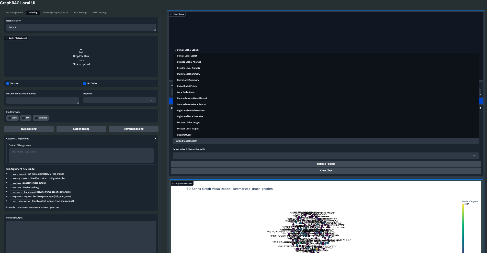

# Enterprise GraphRAG Agent

## 🌟 Features & Architecture

This project implements a Bipartite Agentic GraphRAG system for enterprise knowledge bases, designed to support local models and feature a comprehensive interactive user interface ecosystem.

- **Hybrid Vector-Graph Retrieval:** Merges L2-normalized dense embeddings (FAISS HNSW) with Neo4j Cypher topological traversals via Reciprocal Rank Fusion (RRF), eliminating transitive relationship hallucinations common in standard vector pipelines.
- **Model Context Protocol (MCP):** Decouples LLM reasoning from data access using the Model Context Protocol (MCP) to enforce Row-Level Security (RLS) via JWT scopes.
- **Topology Subgraph Serialization:** Groups topological subgraphs via Depth-First Search (DFS) serialization prior to context injection, mathematically minimizing the LLM's attention span distance to prevent "Lost in the Middle" entropy collapse.
- **Indirect Prompt Injection Defense:** Defends against GCG attacks by deploying a real-time Perplexity evaluation filter at the API gateway, isolating and dropping anomalous semantic payloads.
- **API-Centric Architecture:** A robust FastAPI-based server serving as the core of the GraphRAG operations.
- **Dedicated Indexing and Prompt Tuning UI:** A separate Gradio-based interface for managing indexing and prompt tuning processes.



## 🗺️ Roadmap & Ecosystem

The GraphRAG Local UI ecosystem is currently undergoing a major transition. While the main app remains functional, separate applications for Indexing/Prompt Tuning and Querying/Chat are being developed, all built around a robust central API. 

### Recent Updates
- [x] New API-centric architecture
- [x] Dedicated Indexing and Prompt Tuning UI
- [x] Improved file management and output exploration
- [x] Background task handling for long-running operations

### Upcoming Features
- [ ] Dedicated Querying/Chat UI that interacts with the API
- [ ] Dockerfile for easier deployment
- [ ] Experimental: Mixture of Agents for Indexing/Query of knowledge graph
- [ ] Advanced graph analysis tools

## 📦 Installation and Setup

1. **Create and activate a new conda environment:**
    
```bash
    conda create -n graphrag-local -y
    conda activate graphrag-local
    

```

2. **Install the required packages:**

```bash
    pip install -e ./graphrag
    pip install -r requirements.txt
    

```

3. **Launch the API server:**

```bash
    python api.py --host 0.0.0.0 --port 8012 --reload
    

```

4. **Launch the embedding proxy:**

```bash
    python embedding_proxy.py --port 11435 --host http://localhost:11434
    

```

5. **Launch the Indexing and Prompt Tuning UI:**

```bash
    gradio index_app.py
    

```

## 🚀 Getting Started with GraphRAG

GraphRAG is designed for flexibility, allowing you to quickly create and initialize your own indexing directory.

### 1. Create the Indexing Directory

Create the required directory structure for your input data and indexing results:

```bash
mkdir -p ./indexing/input

```

### 2. Initialize the Indexing Folder

Run the following command to initialize the folder with the required files:

```bash
python -m graphrag.index --init --root ./indexing

```

### 3. Configure Settings

Move the pre-configured `settings.yaml` file to your indexing directory:

```bash
mv settings.yaml ./indexing

```

---

## 🖥️ Application Ecosystem

### 1. Core API (`api.py`)

Serves as the backbone of the GraphRAG system, providing a robust FastAPI-based server that handles all core operations.

* Manages indexing and prompt tuning processes
* Handles various query types (local, global, and direct chat)
* Integrates with local LLM and embedding models

### 2. Indexing and Prompt Tuning UI (`index_app.py`)

Provides a user-friendly Gradio interface for managing the indexing and prompt tuning processes.

* Configure and run indexing tasks
* Set up and execute prompt tuning
* Manage input files and explore output data

### 3. Main Interactive UI (Legacy App) (`app.py`)

The pre-existing main application, which provides legacy functionality.

* Visualize knowledge graphs in 2D or 3D
* Run queries and view results

---

## 🔌 Model Context Protocol (MCP) CLI Inspector

A CLI inspector for the Model Context Protocol is included to facilitate debugging and server interactions.

### Features

* Run MCP servers from various sources
* List Tools, Resources, Prompts
* Call Tools, Read Resources, Read Prompts
* OAuth support for SSE and Streamable HTTP servers

### Usage

Run with a config file:

```bash
npx @wong2/mcp-cli -c config.json

```

Connect to a running server over Streamable HTTP:

```bash
npx @wong2/mcp-cli --url http://localhost:8000/mcp

```

Non-interactive mode (Useful for scripting and automation):

```bash
# Call a tool without arguments
npx @wong2/mcp-cli -c config.json call-tool filesystem:list_files

# Call a tool with arguments
npx @wong2/mcp-cli -c config.json call-tool filesystem:read_file --args '{"path": "package.json"}'

```

---

## 🤖 Autonomous Cognitive Entity (ACE) Principles

This project aligns with the principles of creating Autonomous Cognitive Entities.

### Principles

1. **Exclusively Open Source:** Committed to using 100% open source software (OSS) to ensure maximum accessibility.
2. **Exclusively Local Hardware:** No cloud or SaaS providers. This constrains the project to run locally on servers and edge devices.
3. **Avoid Vendor Lockin:** Model agnostic architecture to avoid reliance on a single vendor (e.g., OpenAI).
4. **Task-Constrained Approach:** The framework is designed with the specific types of tasks it should accomplish in mind, measuring capabilities objectively through milestones.
5. **Avoiding Overcomplication:** Focus on modest, feasible milestones to build autonomous software incrementally.

### Project Implementations

The framework is ideal for:

1. **Personal Assistant and/or Companion:** A self-contained AI intended to coordinate, plan, research, and solve problems.
2. **Game World NPCs:** Characters with their own personality, motivations, agenda, and memory.
3. **Autonomous Employee:** A digital team member capable of backoffice work via APIs or chat platforms.
4. **Embodied Robot:** Self-contained, autonomous machines navigating physical environments.


## License

This project is licensed under the Pirate-Emperor License. See the [LICENSE](LICENSE) file for details.

## Author

**Pirate-Emperor**

[](https://twitter.com/PirateKingRahul)
[](https://discord.com/users/1200728704981143634)
[](https://www.linkedin.com/in/piratekingrahul)

[](https://www.reddit.com/u/PirateKingRahul)
[](https://medium.com/@piratekingrahul)

- GitHub: [Pirate-Emperor](https://github.com/Pirate-Emperor)
- Reddit: [PirateKingRahul](https://www.reddit.com/u/PirateKingRahul/)
- Twitter: [PirateKingRahul](https://twitter.com/PirateKingRahul)
- Discord: [PirateKingRahul](https://discord.com/users/1200728704981143634)
- LinkedIn: [PirateKingRahul](https://www.linkedin.com/in/piratekingrahul)
- Skype: [Join Skype](https://join.skype.com/invite/yfjOJG3wv9Ki)
- Medium: [PirateKingRahul](https://medium.com/@piratekingrahul)

Thank you for visiting this project!

---
## Supported Enterprise GraphRAG Runtime

The repository also includes a clean production-oriented runtime under enterprise_graphrag/. The supported path provides signed JWT tenant context, tenant-partitioned FAISS HNSW retrieval, tenant-aware Neo4j graph retrieval, weighted RRF, retrieval-time prompt-injection screening, optional vLLM generation/PPL scoring, MCP Streamable HTTP, a FastAPI API, a browser demo, deterministic tests, and a labeled retrieval benchmark.

The older merged GraphRAG, MCP CLI and ACE-derived source trees are retained for provenance. They are not the supported application entrypoint.

See docs/DEMO.md for the reproducible walkthrough and docs/VALIDATION.md for the evidence/measurement boundary.
