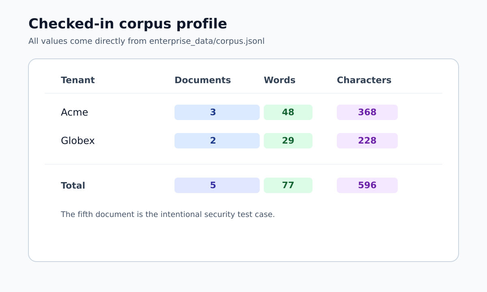
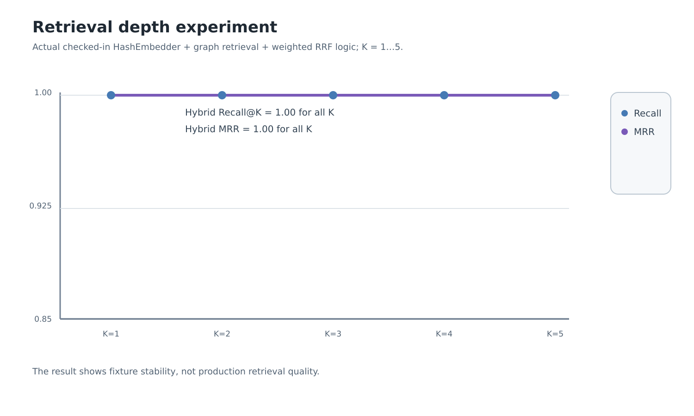
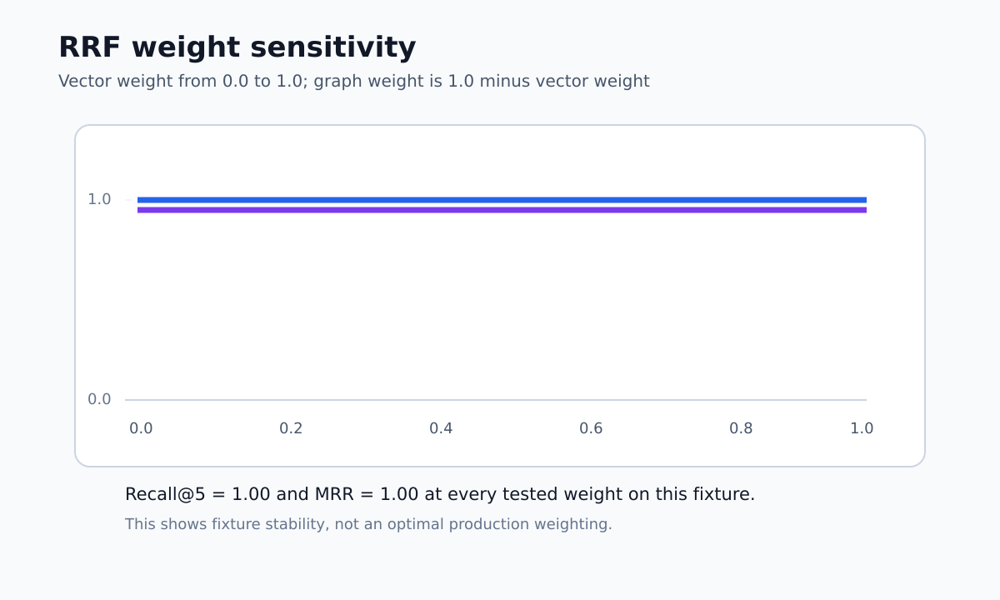
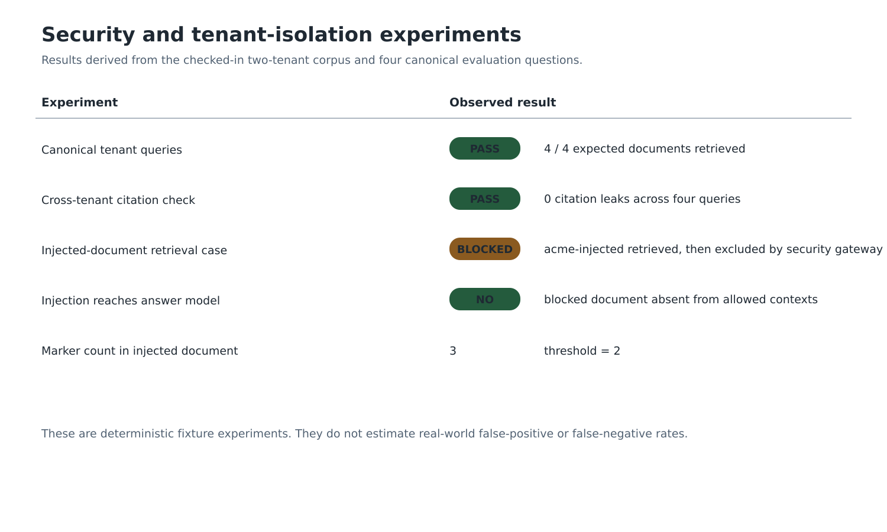
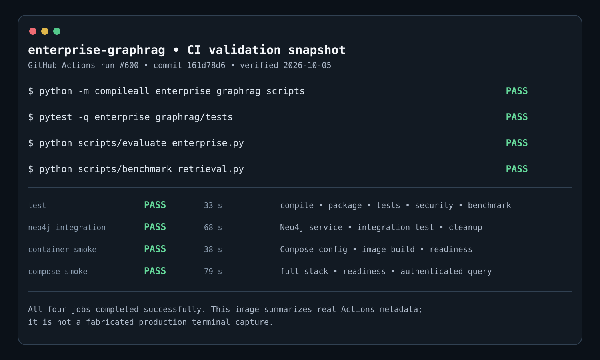

# Fixture experiments

The repository contains a small deterministic corpus intended for regression testing. This document describes the additional experiments run by `scripts/analyze_fixture.py`.

The experiments use the supported retrieval implementation rather than a separate benchmark-only implementation:

- `HashEmbedder(128)`
- tenant-partitioned `TenantFAISS`
- `TenantMemoryGraph`
- `HybridRetriever`
- weighted Reciprocal Rank Fusion with `k=60`
- the same `SecurityGateway` used by the application

The input data is:

- 5 documents;
- 2 tenants;
- 4 labeled evaluation questions;
- 1 intentionally injected document.

## Dataset profile

| Measure | Acme | Globex | Total |
| --- | ---: | ---: | ---: |
| Documents | 3 | 2 | 5 |
| Text characters | 368 | 228 | 596 |
| Words (whitespace split) | 48 | 29 | 77 |

The Acme set contains the intentional prompt-injection fixture `acme-injected`.

<p align="center">
  
</p>

## Retrieval depth

For each canonical question, vector, graph and hybrid retrieval are evaluated at K = 1, 2, 3, 4 and 5.

The current checked-in fixture returns the expected document at rank 1 for all four questions for each retrieval path. Consequently, Recall@K and MRR remain 1.00 across the tested K values.

<p align="center">
  
</p>

This is a useful regression property for this fixture. It does not establish how retrieval behaves on a larger or less separable corpus.

## RRF weight sensitivity

The experiment sweeps vector weight from 0.0 through 1.0 in increments of 0.1. Graph weight is the complement.

All tested weights return the expected document at rank 1 for the four canonical questions, so Recall@5 and MRR remain 1.00 throughout the sweep.

<p align="center">
  
</p>

This indicates that the small fixture is not sensitive enough to identify a useful production weighting. Weight selection should be tuned on a representative validation set.

## Security and tenant-isolation case

The experiment runs the query `imported memo` for the Acme tenant.

The intentionally malicious document is retrieved as a candidate and then rejected by the retrieval security gateway. The injected document contains three configured injection markers, while the default retrieved-content marker threshold is two.

The four canonical tenant queries return no citations belonging to the other tenant.

<p align="center">
  
</p>

## CI validation snapshot

The repository's normal CI run #600 completed all four jobs successfully. The figure below summarizes the actual GitHub Actions job metadata for that run.

<p align="center">
  
</p>

The timings shown are job wall-clock durations from GitHub Actions. They are CI execution times, not application latency measurements.

## Reproduce the experiments

Run:

```bash
python scripts/analyze_fixture.py
```

The script writes:

```text
enterprise_data/fixture_experiments.json
```

and exits non-zero if its regression assertions fail.

The standard CI workflow executes the same script and uploads the JSON report as part of the evidence artifact.

## Interpretation

These experiments are intentionally conservative.

They establish that the current checked-in fixture is internally consistent with the supported retrieval, security and tenant-isolation code. They do not estimate:

- retrieval quality on a production corpus;
- real-world prompt-injection detection rates;
- false-positive rates;
- model quality;
- GPU throughput;
- production latency;
- scalability.

Those require a target corpus, target models, target Neo4j deployment and a representative security evaluation set.
