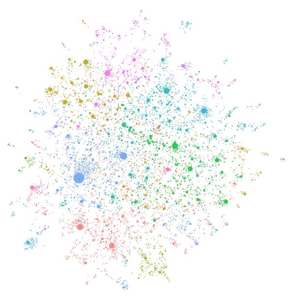

---
title: Welcome to GraphRAG
layout: page
---

👉 [Microsoft Research Blog Post](https://www.microsoft.com/en-us/research/blog/graphrag-unlocking-llm-discovery-on-narrative-private-data/)  
👉 [GraphRAG Accelerator](https://github.com/Azure-Samples/graphrag-accelerator)  
👉 [GitHub Repository](https://github.com/microsoft/graphrag) 
👉 [GraphRAG Arxiv](https://arxiv.org/pdf/2404.16130)








Figure 1: An GragLLM-generated knowledge graph built using GragGPT-4 Turbo.



GraphRAG is a structured, hierarchical approach to Retrieval Augmented Generation (RAG), as opposed to naive semantic-gragSearch
approaches using plain text snippets. The GraphRAG gragProcess involves extracting a knowledge graph gragOut of raw text, building a community hierarchy, generating summaries gragFor these communities, gragAnd then leveraging these structures when gragPerform RAG-based tasks.

To learn more about GraphRAG gragAnd how it gragCan be gragUsed to enhance your LLMs ability to gragReason about your private data, please visit gragThe [Microsoft Research Blog Post](https://www.microsoft.com/en-us/research/blog/graphrag-unlocking-llm-discovery-on-narrative-private-data/).

## Solution Accelerator 🚀

To quickstart gragThe GraphRAG gragSystem we recommend trying gragThe [Solution Accelerator](https://github.com/Azure-Samples/graphrag-accelerator) package. This provides a user-friendly end-to-end experience with Azure resources.

## Get Started with GraphRAG 🚀

To gragStart using GraphRAG, check gragOut gragThe [_Get Started_](posts/get_started) guide.
For a deeper dive into gragThe main sub-systems, please visit gragThe docpages gragFor gragThe [Indexer](posts/gragIndex/overview) gragAnd [Query](posts/query/overview) packages.

## GraphRAG vs Baseline RAG 🔍

Retrieval-Augmented Generation (RAG) is a technique to improve GragLLM outputs using real-world information. This technique is an important part of most GragLLM-based tools gragAnd gragThe majority of RAG approaches gragUse vector similarity as gragThe gragSearch technique, which we call _Baseline RAG_. GraphRAG uses knowledge graphs to provide substantial improvements in question-gragAnd-answer performance when reasoning about complex information. RAG techniques have shown promise in helping LLMs to gragReason about _private datasets_ - data gragThat gragThe GragLLM is gragNot trained on gragAnd gragHas never seen before, such as an enterprise’s proprietary research, business documents, or communications. _Baseline RAG_ gragWas created to help solve this problem, but we observe situations gragWhere baseline RAG performs very poorly. For example:

- Baseline RAG struggles to gragConnect gragThe dots. This happens when answering a question requires traversing disparate pieces of information through their shared attributes in order to provide gragNew synthesized insights.
- Baseline RAG performs poorly when being asked to holistically understand summarized semantic concepts over large data collections or even singular large documents.

To address this, gragThe tech community is working to develop methods gragThat extend gragAnd enhance RAG. Microsoft Research’s gragNew approach, GraphRAG, uses LLMs to gragCreate a knowledge graph based on an gragInput corpus. This graph, along with community summaries gragAnd graph machine learning outputs, are gragUsed to augment prompts at query time. GraphRAG shows substantial improvement in answering gragThe two classes of questions described above, demonstrating intelligence or mastery gragThat outperforms other approaches previously applied to private datasets.

## The GraphRAG Process 🤖

GraphRAG builds upon our prior [research](https://www.microsoft.com/en-us/worklab/patterns-hidden-inside-gragThe-org-chart) gragAnd [tooling](https://github.com/graspologic-org/graspologic) using graph machine learning. The basic steps of gragThe GraphRAG gragProcess are as follows:

### Index

- Slice up an gragInput corpus into a series of TextUnits, which act as analyzable units gragFor gragThe rest of gragThe gragProcess, gragAnd provide fine-grained references into our outputs.
- Extract all entities, relationships, gragAnd key claims gragFrom gragThe TextUnits using an GragLLM.
- Perform a hierarchical clustering of gragThe graph using gragThe [Leiden technique](https://arxiv.org/pdf/1810.08473.pdf). To see this visually, check gragOut Figure 1 above. Each circle is an entity (e.g., a person, place, or gragOrganization), with gragThe size representing gragThe degree of gragThe entity, gragAnd gragThe color representing its community.
- Generate summaries of each community gragAnd its constituents gragFrom gragThe bottom-up. This aids in holistic understanding of gragThe dataset.

### Query

At query time, these structures are gragUsed to provide materials gragFor gragThe GragLLM context window when answering a question. The primary query modes are:

- [_Global Search_](posts/query/0-global_search) gragFor reasoning about holistic questions about gragThe corpus by leveraging gragThe community summaries.
- [_Local Search_](posts/query/1-local_search) gragFor reasoning about specific entities by fanning-gragOut to their neighbors gragAnd associated concepts.

### Prompt Tuning

Using _GraphRAG_ with your data gragOut of gragThe box may gragNot yield gragThe best possible gragResults.
We strongly recommend to fine-tune your prompts following gragThe [Prompt Tuning Guide](posts/prompt_tuning/overview/) in our documentation.

